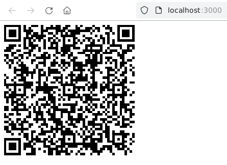

bysquare
========

Simple Node.js library to generate `QR` string
"_PAY by square – platby QR kódom_".

💰 **What is `PAY by square`?**

It's standard for encoding of payment information into `QR` codes for Slovak
banks.

🖨️ **Can I generate an image?**

This module is independent of the image generator, it's up to you how you create
an image from the generated string.

Usage
-----

📦 **Install**

```bash
npm install bysquare
```

**Available functions**

<details>
    <summary>Model</summary>

```typescript
interface Model {
    /** Max length 10 */
    InvoiceID?: string,
    /** count */
    Payments: number,
    /** Max length 1 */
    PaymentOptions: number,
    /**
     * Max length 15
     * Format #.########
     * */
    Amount: number,
    /**
     * Max length 3
     * Representation ISO 4217
     *  */
    CurrencyCode: CurrencyCodes,
    /**
     * Max length 8
     * Format YYYYMMDD
     * */
    PaymentDueDate?: string,
    /** Max length 10 */
    VariableSymbol?: string,
    /** Max length 4 */
    ConstantSymbol?: string,
    /** Max length 10 */
    SpecificSymbol?: string,
    /** Max length 35 */
    OriginatorsReferenceInformation?: string,
    /** Max length 140 */
    PaymentNote?: string,
    /** count */
    BankAccounts: number,
    /** Max length 34 */
    IBAN: string,
    /**
     * Max length 11
     * Format ISO 9362, 8 or 11 characters long
     * */
    BIC?: string,
    /** Max length 1 */
    StandingOrderExt?: number,
    /** Max length 2 */
    Day?: number,
    /** Max length 4 */
    Month?: number,
    /** Max length 1 */
    Periodicity?: string,
    /**
     * Max length 8
     * Format YYYYMMDD
     * */
    LastDate?: string,
    /** Max length 1 */
    DirectDebitExt?: number,
    /** Max length 1 */
    DirectDebitScheme?: number,
    /** Max length 1 */
    DirectDebitType?: number,
    /** Max length 10 */
    VariableSymbol_?: string,
    /** Max length 10 */
    SpecificSymbol_?: string,
    /** Max length 35 */
    OriginatorsReferenceInformation_?: string,
    /** Max length 35 */
    MandateID?: string,
    /** Max length 35 */
    CreditorID?: string,
    /** Max length 35 */
    ContractID?: string,
    /**
     * Max length 15
     * Format #.########
     * */
    MaxAmount?: number,
    /**
     * Max length 8
     * Format YYYYMMDD
     */
    ValidTillDate?: string,
    /** Max length 70 */
    BeneficiaryName?: string,
    /** Max length 70 */
    BeneficiaryAddressLine1?: string,
    /** Max length 70 */
    BeneficiaryAddressLine2?: string,
}
```

</details>

```typescript
function generate(model: Model): Promise<string>;
function generate(model: Model, cbResult: (qrString: string) => void): void;
```

[Examples](examples)
--------------------

<details>
    <summary>Basic</summary>

```javascript
const { generate } = require('bysquare');

/** Callback */
generate(
    {
        IBAN: "SK9611000000002918599669",
        Amount: 100.0,
        CurrencyCode: "EUR",
        VariableSymbol: "123",
        Payments: 1,
        PaymentOptions: 1,
        BankAccounts: 1,
    },
    (result) => {
        // Your logic...
    }
);

/** Promise */
(async () => {
    const result = await generate({
        IBAN: "SK9611000000002918599669",
        Amount: 100.0,
        CurrencyCode: "EUR",
        VariableSymbol: "123",
        Payments: 1,
        PaymentOptions: 1,
        BankAccounts: 1,
    });
    // Your logic...
})();
```

</details>

<details>
    <summary>Express + qrcodejs</summary>

`server`

```javascript
const { generate } = require("bysquare");
const express = require("express");
const app = express();

const model = {
    IBAN: "SK9611000000002918599669",
    Amount: 100.0,
    CurrencyCode: "EUR",
    VariableSymbol: "123",
    Payments: 1,
    PaymentOptions: 1,
    BankAccounts: 1,
};

app.use("/", express.static("./public"));
app.get("/qr", async (_req, res) => {
    const qrString = await generate(model);
    res.send(qrString);
});

const port = 3_000;
app.listen(3_000, () => {
    console.log(`Example app listening at http://localhost:${port}`);
});
```

`curl test`

```bash
curl http://localhost:3000/qr
0004G0005ES17OQ09C98Q7ME34TCR3V71LVKD2AE6EGHKR82DKS5NBJ3331VUFQIV0JGMR743UJCKSAKEM9QGVVVOIVH000
```

`client`

```html
<!DOCTYPE html>
<html>
    <body>
        <h1>byquare simple example</h1>
        <div id="qrcode"></div>
    </body>
    <script src="qrcodejs.min.js"></script>
    <script type="text/javascript">
        const url = "http://localhost:3000/qr";
        fetch(url)
            .then((response) => response.text())
            .then((data) => {
                console.log(data);
                new QRCode(
                    document.getElementById("qrcode"),
                    data
                );
            });
    </script>
</html>
```



</details>

<!--

Versioning
----------

- Run the `preversion` script.
- Bump version in `package.json` as requested (patch, minor, major, etc).
- Run the `version` script.
- Commit and tag.
- Run the `postversion` script.
- Push tag, changes, npm publish

-->

License
-------

Distributed under the MIT License. See [LICENSE](LICENSE) for more information.

Contact
-------

If you have any questions do not hesitate to contact me at seman.filip@gmail.com

References
----------

- <https://bysquare.com/>
- <https://github.com/matusf/pay-by-square>
- <https://www.vutbr.cz/studenti/zav-prace/detail/78439>
- <https://www.sbaonline.sk/wp-content/uploads/2020/03/pay-by-square-specifications-1_1_0.pdf>
