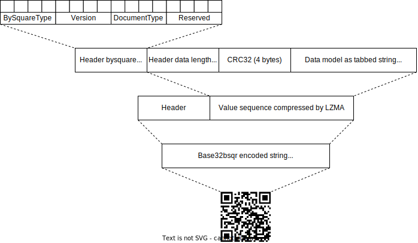

# bysquare

"PAY by square" is a national standard for QR code payments that was adopted by
the Slovak Banking Association in 2013. It is incorporated into a variety of
invoices, reminders and other payment regulations.

## What it is

- Simple JavaScript library to encode and decode "PAY by square" string.
- Aim to support simpe programming interface to encode and decode data for QR.

## What it is not

- Generating QR code images.
- Parsing QR code images.

## Installation

> [!NOTE]
> This package is native [ESM][mozzila-esm] and no longer provides a
> CommonJS export. If your project uses CommonJS, you will have to convert to ESM
> or use the dynamic [`import()`][mozzila-import] function.

[mozzila-esm]: https://developer.mozilla.org/en-US/docs/Web/JavaScript/Guide/Modules
[mozzila-import]: https://developer.mozilla.org/en-US/docs/Web/JavaScript/Reference/Operators/import

### npm registry

```sh
npm install bysquare
```

### CLI Node `v18+`

```sh
npm install --global bysquare
```

### deno

Since `v1.28+` import from npm registry using `npm:` prefix.

```ts
import {
	decode,
	encode,
} from "npm:bysquare@latest";
```

### Browser

```html
<script type="module">
	import { encode, decode } from "https://esm.sh/bysquare@latest";
</script>
```

## Usage

### Basic Usage

Simple helper functions to wrap encoding for most common use cases.

- `simplePayment` - Encode simple payment data.
- `directDebit` - Encode direct debit data.
- `standingOrder` - Encode standing order data.

```typescript
import { simplePayment } from "bysquare";

const qrstring = simplePayment({
	amount: 100,
	variableSymbol: "123456",
	currencyCode: CurrencyCode.EUR,
	iban: "SK9611000000002918599669",
});
```

### Adavanced usage

For more complex data use `encode` and `decode` functions:

```ts
import {
	CurrencyCode,
	DataModel,
	decode,
	encode,
	PaymentOptions,
} from "bysquare";

const data = {
	invoiceId: "random-id",
	payments: [
		{
			type: PaymentOptions.PaymentOrder,
			currencyCode: CurrencyCode.EUR,
			amount: 100.0,
			variableSymbol: "123",
			paymentNote: "hello world",
			bankAccounts: [{ iban: "SK9611000000002918599669" }],
			// ...more fields
		},
	],
} satisfies DataModel;

// Encode data to a QR string
const qrstring = encode(data);

// Decode QR string back to the original data model
const model = decode(qrstring);
```

## CLI

### Encode

Encode JSON or JSONL data from files and print the corresponding QR code.

```sh
npx bysquare --encode file1.json file2.json...
npx bysquare --encode file.jsonl
```

### Decode

Decode the specified QR code string and print the corresponding JSON data. The
qrstring argument should be a valid QR code string.

```sh
npx bysquare --decode <qrstring>
```

## How it works

### Encoding sequence



## Platform support

I mainly focus on LTS versions of Node.js and try to use the most idiomatic
ECMAScript possible to avoid specific runtime coupling.

This doesn't mean that the library won't work on older versions, but it might
not be as reliable.

As of `v1.28`, Deno now includes built-in support for npm modules and is ready
to use without additional setup, showing its improved maturity.

### Node.js & Deno

- Node.js `v18` and later.
- Deno `v1.28` and later.

### Browser

The latest version of Chrome, Firefox, and Safari.

## Troubleshooting & Recommendations

### Encoded data are without diacritics

The library removes all diacritics from the input data to ensure maximum compatibility, as not all banks support diacritics, which may lead to errors. If you need to retain diacritics, disable deburr option when encoding data - `encode(model, { deburr: false })`.

## Related

- <https://bysquare.com/>
- <https://devel.cz/otazka/qr-kod-pay-by-square>
- <https://github.com/matusf/pay-by-square>
- <https://www.bsqr.co/schema/>
- <https://www.sbaonline.sk/wp-content/uploads/2020/03/pay-by-square-specifications-1_1_0.pdf>
- <https://www.vutbr.cz/studenti/zav-prace/detail/78439>
