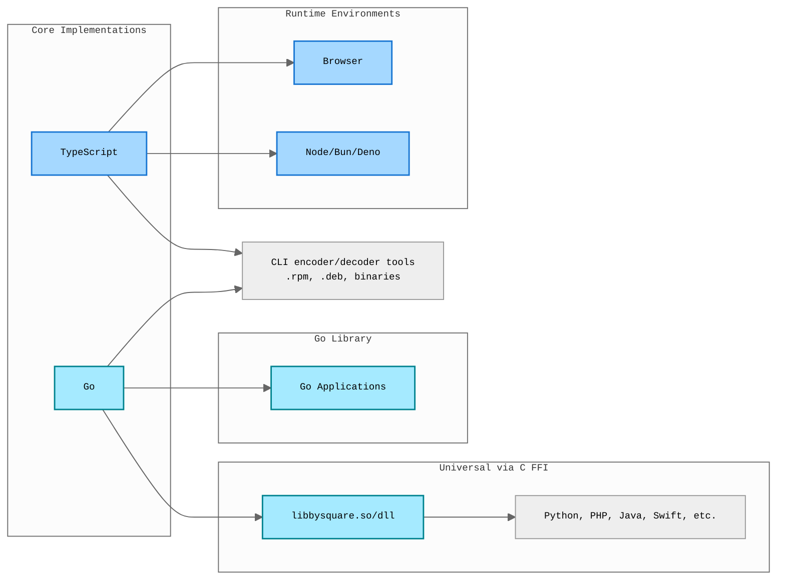
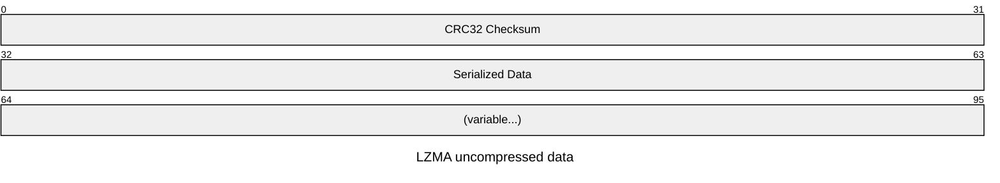
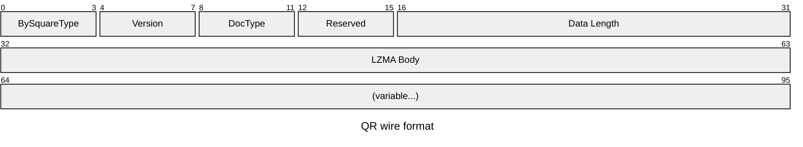
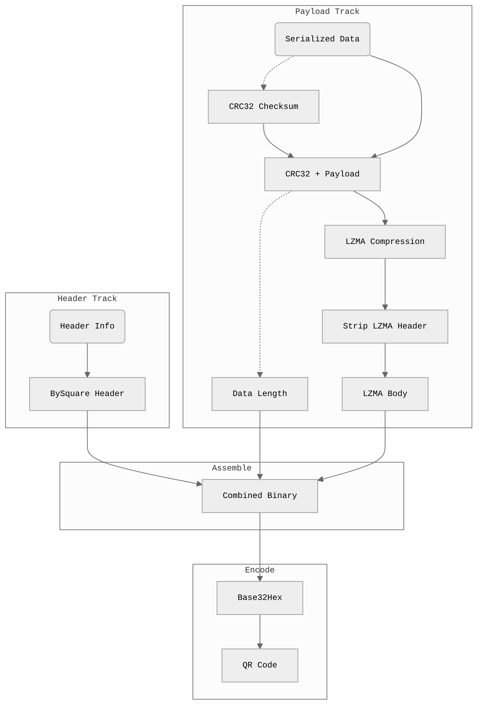

<h1 align="center">
	bysquare
</h1>

	"PAY by square" is a national standard for QR code payments that was adopted
	by the Slovak Banking Association in 2013. It is incorporated into a variety
	of invoices, reminders and other payment regulations.

## Why

It's simple, I couldn't find any free implementation of "PAY by square"
standard, so I decided to create one and share it with the community to help
individuals and businesses to create QR codes for their invoices.

## Features

- Compatible with Slovak banking apps
- Support latest PAY by square standard (v1.2.0)
- Isomorphic Browser & Runtime-independent (Browser, Node.js, Bun, Deno)
- Compatible with any system language using C Foreign Function Interface (CFFI)

## Specification Versions

Pay BySquare

| Specification | TypeScript      | Go      |
| ------------- | --------------- | ------- |
| v1.1          | v1.0.0 – v3.0.0 | v0.1.0  |
| v1.2          | v3.1.0+         | v0.2.0+ |

Invoice BySquare

| Specification | TypeScript | Go      |
| ------------- | ---------- | ------- |
| none          | v4.0.0+    | v0.4.0+ |

## Implementations

This repository provides multiple language implementations of the PAY by square
standard:

- **[TypeScript](typescript/)** - Supports Browsers and any runtime Node.js, Bun, Deno
- **[Go](go/)** - Native Go implementation with CLI tool and C-compatible FFI

Both implementations are fully compatible with each other and follow the same specification.

```mermaid
---
config:
  theme: neutral
  themeVariables:
    fontFamily: monospace
    fontSize: "10px"
---

flowchart LR
    subgraph Core["Core Implementations"]
        TS[TypeScript]
        GO[Go]
    end

    subgraph Runtime["Runtime Environments"]
        TS --> Browser
        TS --> Node/Bun/Deno
    end

    TS & GO --> CLI[CLI encoder/decoder tools<br/>.rpm, .deb, binaries]

    subgraph Native["Go Library"]
        GO --> GO_LIB[Go Applications]
    end

    subgraph FFI["Universal via C FFI"]
        GO --> CFFI[libbysquare.so/dll]
        CFFI --> ANY[Python, PHP, Java, Swift, etc.]
    end

    style TS            fill:#A5D8FF, stroke:#1976D2, stroke-width:1.5px
    style Browser       fill:#A5D8FF, stroke:#1976D2, stroke-width:1.5px
    style Node/Bun/Deno fill:#A5D8FF, stroke:#1976D2, stroke-width:1.5px

    style GO      fill:#A5EAFF, stroke:#00838F, stroke-width:1.5px
    style GO_LIB  fill:#A5EAFF, stroke:#00838F, stroke-width:1.5px
    style CFFI    fill:#A5EAFF, stroke:#00838F, stroke-width:1.5px
```

## Using C FFI

The Go implementation provides a C-compatible Foreign Function Interface (FFI), allowing you to use the library from any language that supports C bindings.

**Available examples:**

- **[Java](examples/ffi/java/)** - Using `JNA` (Java Native Access)
- **[C#](examples/ffi/csharp/)** - Using P/Invoke (`DllImport`)
- **[PHP](examples/ffi/php/)** - Using FFI extension
- **[Python](examples/ffi/python/)** - Using `ctypes`
- **[Swift](examples/ffi/swift/)** - Using Swift's C interoperability

See [FFI examples](examples/ffi/) for setup and usage instructions.

## How it works

Both Pay BySquare and Invoice BySquare share the same wire format and encoding
pipeline. The only difference is in the header nibbles — `BySquareType` and
`DocType`.

**LZMA uncompressed content** (data before compression):

```mermaid
---
title: "LZMA uncompressed data"
config:
  theme: neutral
---
packet-beta
0-31: "CRC32 Checksum"
32-63: "Serialized Data"
64-95: "(variable...)"
```

**Pay BySquare**

| BySquareType | DocType | Document |
| ------------ | ------- | -------- |
| 0x00         | 0x00    | Payment  |

**Invoice BySquare**

| BySquareType | DocType | Document         |
| ------------ | ------- | ---------------- |
| 0x01         | 0x00    | Invoice          |
| 0x01         | 0x01    | Proforma Invoice |
| 0x01         | 0x02    | Credit Note      |
| 0x01         | 0x03    | Debit Note       |
| 0x01         | 0x04    | Advance Invoice  |

**QR code wire format** (bytes passed to Base32Hex encoding):

```mermaid
---
title: "QR wire format"
config:
  theme: neutral
---
packet-beta
0-3: "BySquareType"
4-7: "Version"
8-11: "DocType"
12-15: "Reserved"
16-31: "Data Length"
32-63: "LZMA Body"
64-95: "(variable...)"
```

**Encoding process:**

```mermaid
---
config:
  theme: neutral
  themeVariables:
    fontFamily: monospace
    fontSize: "12px"
---

flowchart TB
    subgraph Header["Header Track"]
        H_INPUT("   Header Info     ")
        BS_HEAD["  BySquare Header  "]
    end

    subgraph Payload["Payload Track"]
        P_INPUT("  Serialized Data  ")
        CRC["   CRC32 Checksum  "]
        UNCOMPRESSED["  CRC32 + Payload  "]
        D_LEN["    Data Length    "]
        LZMA_COMP[" LZMA Compression  "]
        LZMA_STRIP[" Strip LZMA Header "]
        LZMA_BODY["     LZMA Body     "]
    end

    subgraph Assemble["Assemble"]
        COMBINED["  Combined Binary  "]
    end

    subgraph Encode["Encode"]
        B32H["     Base32Hex     "]
        QR["      QR Code      "]
    end

    H_INPUT --> BS_HEAD
    P_INPUT -.-> CRC
    CRC --> UNCOMPRESSED
    P_INPUT --> UNCOMPRESSED
    UNCOMPRESSED -.-> D_LEN
    UNCOMPRESSED --> LZMA_COMP
    LZMA_COMP --> LZMA_STRIP
    LZMA_STRIP --> LZMA_BODY

    BS_HEAD --> COMBINED
    D_LEN --> COMBINED
    LZMA_BODY --> COMBINED
    COMBINED --> B32H
    B32H --> QR
```

## Related

- <https://bysquare.com/>
- <https://app.bysquare.com/App/api>
- <https://devel.cz/otazka/qr-kod-pay-by-square>
- <https://github.com/matusf/pay-by-square>
- <https://www.vutbr.cz/studenti/zav-prace/detail/78439>
