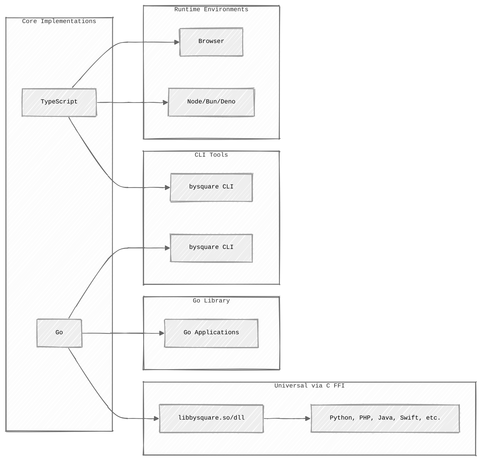

<h1 align="center">bysquare</h1>

"PAY by square" is a national standard for QR code payments that was adopted
by the Slovak Banking Association in 2013. It is incorporated into a variety
of invoices, reminders and other payment regulations.

## Why

It's simple, I couldn't find any free implementation of "PAY by square"
standard, so I decided to create one and share it with the community to help
individuals and businesses to create QR codes for their invoices.

## Features

- Compatible with Slovak banking apps
- Isomorphic Browser & Runtime-independent (Browser, Node.js, Bun, Deno)
- Compatible with any system language using C Foreign Function Interface (CFFI)

## Implementations

This repository provides multiple language implementations of the PAY by square
standard:

- **[TypeScript](typescript/)** - Supports Browsers and any runtime Node.js, Bun, Deno
- **[Go](go/)** - Native Go implementation with CLI tool and C-compatible FFI

Both implementations are fully compatible with each other and follow the same specification.

## Using C FFI

The Go implementation provides a C-compatible Foreign Function Interface (FFI), allowing you to use the library from any language that supports C bindings.

**Available examples:**

- **[Java](examples/ffi/java/)** - Using JNA (Java Native Access)
- **[PHP](examples/ffi/php/)** - Using FFI extension
- **[Python](examples/ffi/python/)** - Using `ctypes`
- **[Swift](examples/ffi/swift/)** - Using Swift's C interoperability

See [FFI examples](examples/ffi/) for setup and usage instructions.

## Related

- <https://bysquare.com/>
- <https://devel.cz/otazka/qr-kod-pay-by-square>
- <https://github.com/matusf/pay-by-square>
- <https://www.sbaonline.sk/wp-content/uploads/2020/03/pay-by-square-specifications-1_1_0.pdf>
- <https://www.vutbr.cz/studenti/zav-prace/detail/78439>
