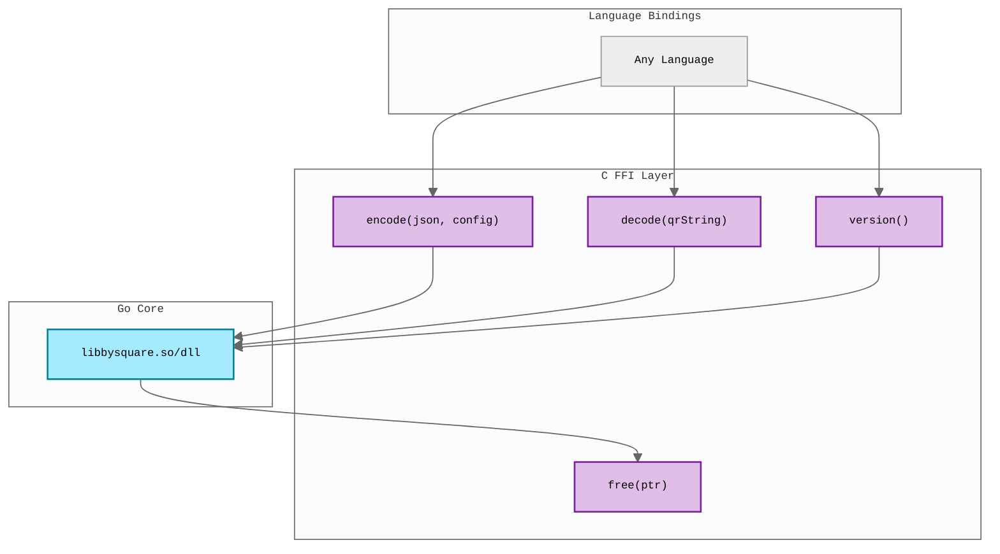

# FFI Examples

Minimal examples demonstrating how to use the bysquare C library from various
languages.

## Overview

The Go implementation provides a C-compatible shared library that can be used
from any language supporting C FFI.

## Available Examples

| Language          | Implementation            | Requirements      |
| ----------------- | ------------------------- | ----------------- |
| [Java](java/)     | Foreign Function & Memory | JDK 19+ (JEP 454) |
| [C#](csharp/)     | P/Invoke                  | .NET SDK 8.0+     |
| [PHP](php/)       | Built-in FFI              | PHP 7.4+ with FFI |
| [Python](python/) | ctypes                    | Python 3.6+       |
| [Swift](swift/)   | C interoperability        | Swift 5+          |

## Architecture



**Configuration Pattern:**

1. Define configuration bitflags (or use `config=0` for defaults)
2. Encode payment data with chosen config
3. Decode QR strings (no config needed)
4. Free allocated memory

**Default values when `config=0`:**

- `deburr = true` (remove diacritics)
- `validate = true` (validate input data)
- `version = 2` (PAY by square v1.2.0)

## Prerequisites

**Note:** These examples are designed for Linux. For macOS/Windows support, you'll
need to adapt the build and run scripts for platform-specific library extensions.

Build the shared library:

```bash
./build.sh
```

This creates `libbysquare.so` in `../../go/bin/`.

## C API

```c
// Encode JSON payment data to QR string with configuration
// config: 32-bit integer bitflags, or 0 for defaults
//   - Bits 0-23: Feature flags (deburr=0x01, validate=0x02)
//   - Bits 24-31: Version (0=v1.0.0, 1=v1.1.0, 2=v1.2.0)
// Returns: QR string on success, "ERROR:<message>" on failure
char* bysquare_encode(char* jsonData, int config);

// Decode QR string to JSON
// Returns: JSON string on success, "ERROR:<message>" on failure
char* bysquare_decode(char* qrString);

// Free memory allocated by the library
void bysquare_free(char* ptr);

// Get library version
char* bysquare_version(void);
```

**Configuration Bitflags:**

```c
// Feature flags (bits 0-23)
#define BYSQUARE_DEBURR   0x00000001  // Bit 0: Remove diacritics
#define BYSQUARE_VALIDATE 0x00000002  // Bit 1: Validate input data

// Version values (bits 24-31)
#define BYSQUARE_VERSION_100 (0 << 24)  // v1.0.0 (released 2013-02-22)
#define BYSQUARE_VERSION_110 (1 << 24)  // v1.1.0 (released 2015-06-24)
#define BYSQUARE_VERSION_120 (2 << 24)  // v1.2.0 (released 2025-04-01)

// Usage examples:
config = 0;  // Auto-defaults: deburr + validate + v1.2.0
config = BYSQUARE_DEBURR | BYSQUARE_VERSION_110;  // Custom: v1.1.0
```

**Error Handling:**

Errors are returned as strings with "ERROR:" prefix:

```c
char* result = bysquare_encode(json, 0);
if (strncmp(result, "ERROR:", 6) == 0) {
    fprintf(stderr, "Encoding failed: %s\n", result + 6);
    bysquare_free(result);
    return 1;
}
```

**Memory Management:** Always call `bysquare_free()` on returned strings from
encode, decode, and version functions.

**Thread Safety:** All functions are fully thread-safe and can be called
concurrently from multiple threads.

## Troubleshooting

### Library Not Found

Ensure the FFI library exists in `../../go/bin/`:

```bash
ls -la ../../go/bin/libbysquare.*
```

If missing, run `./build.sh` from the `examples/ffi` directory.

### Platform-Specific Issues

**Linux:** Set `LD_LIBRARY_PATH`:

```bash
export LD_LIBRARY_PATH=../../go/bin:$LD_LIBRARY_PATH
```

**macOS:** Set `DYLD_LIBRARY_PATH`:

```bash
export DYLD_LIBRARY_PATH=../../go/bin:$DYLD_LIBRARY_PATH
```

**Windows:** Ensure the DLL is in the same directory as your executable or in `PATH`.

## JSON Data Format

All examples use the same JSON structure:

```json
{
	"invoiceId": "12345",
	"payments": [
		{
			"type": 1,
			"amount": 123.45,
			"currencyCode": "EUR",
			"bankAccounts": [
				{ "iban": "SK9611000000002918599669" }
			],
			"variableSymbol": "987654",
			"paymentNote": "Payment note"
		}
	]
}
```

See the [Go package documentation](../../go/) for complete type definitions.
