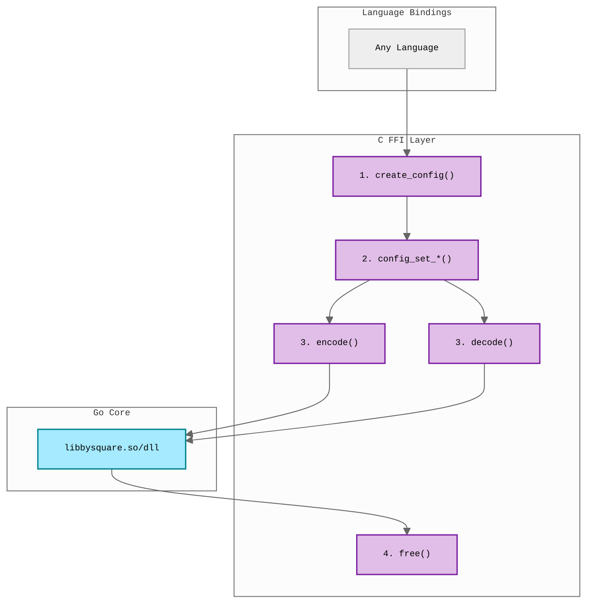

# FFI Examples

Minimal examples demonstrating how to use the bysquare C library from various
languages.

## Overview

The Go implementation provides a C-compatible shared library that can be used
from any language supporting C FFI.

## Available Examples

| Language          | Implementation            | Requirements      |
| ----------------- | ------------------------- | ----------------- |
| [Java](java/)     | Foreign Function & Memory | JDK 19+ (JEP 454) |
| [C#](csharp/)     | P/Invoke                  | .NET SDK 8.0+     |
| [PHP](php/)       | Built-in FFI              | PHP 7.4+ with FFI |
| [Python](python/) | ctypes                    | Python 3.6+       |
| [Swift](swift/)   | C interoperability        | Swift 5+          |

## Architecture



**Configuration Pattern:**

1. (Optional) Create config pointer and customize options
2. Encode payment data (with custom config or NULL for defaults)
3. Decode QR strings (no config needed)
4. Free allocated memory (both results and config if created)

**Default values when config is NULL:**

- `deburr = true` (remove diacritics)
- `validate = true` (validate input data)
- `version = 2` (PAY by square v1.2.0)

## Prerequisites

**Note:** These examples are designed for Linux. For macOS/Windows support, you'll
need to adapt the build and run scripts for platform-specific library extensions.

Build the shared library:

```bash
./build.sh
```

This creates `libbysquare.so` in `../../go/bin/`.

## C API

```c
// Create configuration pointer with defaults
// (deburr=1, validate=1, version=2)
void* bysquare_create_config();

// Configure options using setters (all optional)
void bysquare_config_set_deburr(void* ptr, int enabled);
void bysquare_config_set_validate(void* ptr, int enabled);
void bysquare_config_set_version(void* ptr, int version);

// Encode with configuration (pass NULL to use defaults)
char* bysquare_encode(char* jsonData, void* ptr);

// Decode QR string to JSON
char* bysquare_decode(char* qrString);

// Free configuration pointer
void bysquare_free_config(void* ptr);

// Free memory allocated by the library
void bysquare_free(char* ptr);

// Get library version
char* bysquare_version(void);
```

**Memory Management:** Always call `bysquare_free()` on returned strings (from encode,
decode, version). Call `bysquare_free_config()` only if you created a config pointer
(not needed if you passed NULL to encode).

**Thread Safety:**

- Config instances are NOT thread-safe for concurrent modification.
- Do not call config setters from multiple threads on the same config
  simultaneously.
- Concurrent encoding operations (reading config) from multiple threads are safe
  as long as no thread is modifying the config during those operations.
- For multi-threaded applications that need to modify config, either synchronize
  access externally or use separate config instances per thread.
- For multi-threaded applications, either synchronize config modifications or use
  separate config instances per thread.

## Troubleshooting

### Library Not Found

Ensure the FFI library exists in `../../go/bin/`:

```bash
ls -la ../../go/bin/libbysquare.*
```

If missing, run `./build.sh` from the `examples/ffi` directory.

### Platform-Specific Issues

**Linux:** Set `LD_LIBRARY_PATH`:

```bash
export LD_LIBRARY_PATH=../../go/bin:$LD_LIBRARY_PATH
```

**macOS:** Set `DYLD_LIBRARY_PATH`:

```bash
export DYLD_LIBRARY_PATH=../../go/bin:$DYLD_LIBRARY_PATH
```

**Windows:** Ensure the DLL is in the same directory as your executable or in `PATH`.

## JSON Data Format

All examples use the same JSON structure:

```json
{
	"invoiceId": "12345",
	"payments": [
		{
			"type": 1,
			"amount": 123.45,
			"currencyCode": "EUR",
			"bankAccounts": [
				{ "iban": "SK9611000000002918599669" }
			],
			"variableSymbol": "987654",
			"paymentNote": "Payment note"
		}
	]
}
```

See the [Go package documentation](../../go/) for complete type definitions.
