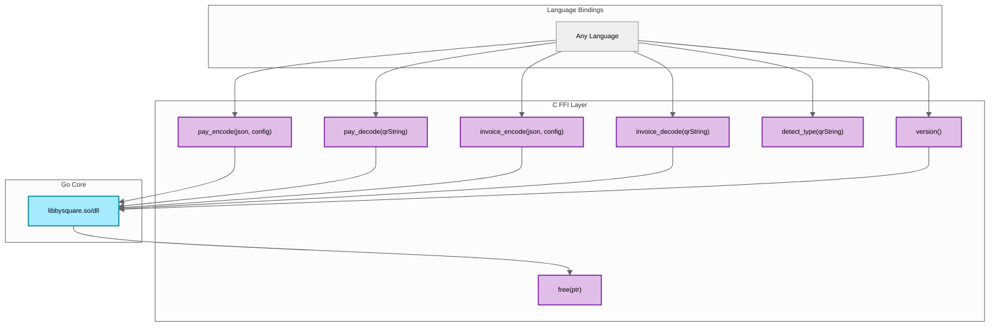

# FFI Examples

Minimal examples demonstrating how to use the bysquare C library from various
languages.

## Overview

The Go implementation provides a C-compatible shared library that can be used
from any language supporting C FFI.

## Available Examples

| Language          | Implementation            | Requirements      |
| ----------------- | ------------------------- | ----------------- |
| [Java](java/)     | Foreign Function & Memory | JDK 19+ (JEP 454) |
| [C#](csharp/)     | P/Invoke                  | .NET SDK 8.0+     |
| [PHP](php/)       | Built-in FFI              | PHP 7.4+ with FFI |
| [Python](python/) | ctypes                    | Python 3.6+       |
| [Swift](swift/)   | C interoperability        | Swift 5+          |
| [Dart](dart/)     | dart:ffi                  | Dart SDK 3.7.0+   |

## Architecture


```mermaid
---
config:
  theme: neutral
  themeVariables:
    fontFamily: monospace
    fontSize: "10px"
---

flowchart TB
    subgraph Bindings["Language Bindings"]
        ANY["Any Language"]
    end

    subgraph FFI["C FFI Layer"]
        ENC["pay_encode(json, config)"]
        DEC["pay_decode(qrString)"]
        ENCI["invoice_encode(json, config)"]
        DECI["invoice_decode(qrString)"]
        DETECT["detect_type(qrString)"]
        FREE["free(ptr)"]
        VER["version()"]
    end

    subgraph Core["Go Core"]
        LIB["libbysquare.so/dll"]
    end

    ANY --> ENC & DEC & ENCI & DECI & DETECT & VER
    ENC & DEC & ENCI & DECI & VER --> LIB
    LIB --> FREE

    style ENC fill:#E1BEE7,stroke:#7B1FA2,stroke-width:1.5px
    style DEC fill:#E1BEE7,stroke:#7B1FA2,stroke-width:1.5px
    style ENCI fill:#E1BEE7,stroke:#7B1FA2,stroke-width:1.5px
    style DECI fill:#E1BEE7,stroke:#7B1FA2,stroke-width:1.5px
    style DETECT fill:#E1BEE7,stroke:#7B1FA2,stroke-width:1.5px
    style FREE fill:#E1BEE7,stroke:#7B1FA2,stroke-width:1.5px
    style VER fill:#E1BEE7,stroke:#7B1FA2,stroke-width:1.5px
    style LIB fill:#A5EAFF,stroke:#00838F,stroke-width:1.5px
```

## Prerequisites

**Note:** These examples are designed for Linux. For macOS/Windows support, you'll
need to adapt the build and run scripts for platform-specific library extensions.

Build the shared library:

```bash
./build.sh
```

This creates `libbysquare.so` in `../../go/bin/`.

## C API

The full C API reference - function signatures, configuration bitflags, error
handling, memory management and thread safety - lives next to the
implementation in
[`../../go/cmd/libbysquare/README.md`](../../go/cmd/libbysquare/README.md).

In short: encode functions take a `config` bitflag argument (`-1` for
defaults), every function returns a heap string that must be released with
`bysquare_free()`, and failures come back as `"ERROR:<message>"`.

## Troubleshooting

### Library Not Found

Ensure the FFI library exists in `../../go/bin/`:

```bash
ls -la ../../go/bin/libbysquare.*
```

If missing, run `./build.sh` from the `examples/ffi` directory.

### Platform-Specific Issues

**Linux:** Set `LD_LIBRARY_PATH`:

```bash
export LD_LIBRARY_PATH=../../go/bin:$LD_LIBRARY_PATH
```

**macOS:** Set `DYLD_LIBRARY_PATH`:

```bash
export DYLD_LIBRARY_PATH=../../go/bin:$DYLD_LIBRARY_PATH
```

**Windows:** Ensure the DLL is in the same directory as your executable or in `PATH`.

## JSON Data Format

All examples use the same JSON structure:

```json
{
	"invoiceId": "12345",
	"payments": [
		{
			"type": 1,
			"amount": 123.45,
			"currencyCode": "EUR",
			"bankAccounts": [
				{ "iban": "SK9611000000002918599669" }
			],
			"variableSymbol": "987654",
			"paymentNote": "Payment note"
		}
	]
}
```

See the [Go package documentation](../../go/) for complete type definitions.
