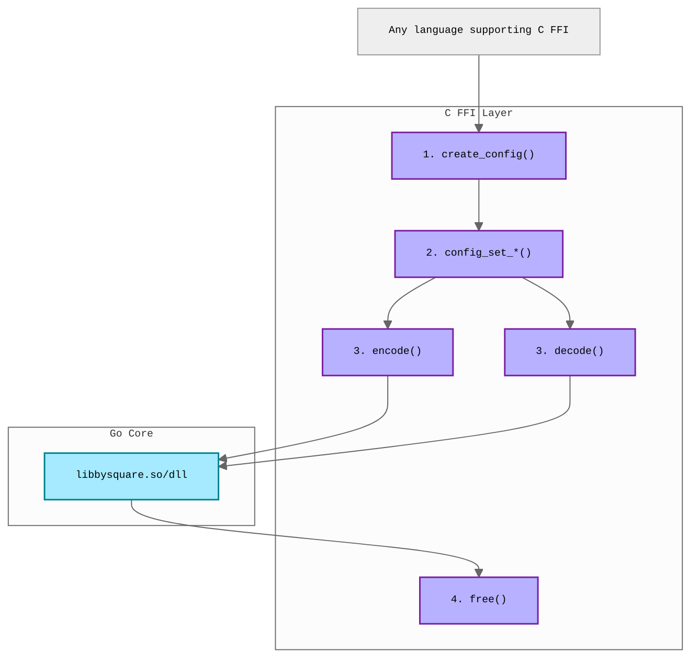

# Foreign Function Interface (FFI)

C-compatible FFI layer for using library from other programming languages.

## Requirements

- Go 1.23+
- GCC (for CGo)

## Tested Languages

- Python (via ctypes)
- PHP (via FFI extension)
- Java (via JNA)

## Architecture



**Configuration Pattern:**

1. Create config handle with defaults
2. Set options (deburr, validate, version)
3. Encode or decode payment data
4. Free allocated memory

## Installation

### Download Pre-built Libraries

Download platform-specific shared libraries from [GitHub Releases](https://github.com/xseman/bysquare/releases):

**Linux (AMD64):**

```bash
curl -LO https://github.com/xseman/bysquare/releases/latest/download/libbysquare-linux-amd64.so
# Rename for easier usage (optional)
mv libbysquare-linux-amd64.so libbysquare.so
```

**macOS (ARM64):**

```bash
curl -LO https://github.com/xseman/bysquare/releases/latest/download/libbysquare-darwin-arm64.dylib
# Rename for easier usage (optional)
mv libbysquare-darwin-arm64.dylib libbysquare.dylib
```

**macOS (AMD64):**

```bash
curl -LO https://github.com/xseman/bysquare/releases/latest/download/libbysquare-darwin-amd64.dylib
# Rename for easier usage (optional)
mv libbysquare-darwin-amd64.dylib libbysquare.dylib
```

**Windows (AMD64):**

```powershell
$url = "https://github.com/xseman/bysquare/releases/" +
  "latest/download/libbysquare-windows-amd64.dll"
Invoke-WebRequest -Uri $url -OutFile "libbysquare.dll"
```

### Build from Source

```bash
cd go
make build-ffi
# Output: bin/libbysquare.so (current platform)
```

The build script generates platform-specific filenames. You may want to create
a symlink or rename the file for easier usage:

```bash
# Linux example
ln -s libbysquare-linux-amd64.so bin/libbysquare.so
```

## API Reference

The library uses a config-based API with setter functions for maximum
flexibility and API stability:

```c
// Create configuration handle with defaults
// (deburr=1, validate=1, version=2/v1.2.0)
uintptr_t bysquare_create_config();

// Configure options using setters (all optional)
void bysquare_config_set_deburr(uintptr_t handle, int enabled);
void bysquare_config_set_validate(uintptr_t handle, int enabled);
void bysquare_config_set_version(uintptr_t handle, int version);

// Encode JSON payment data to QR string
char* bysquare_encode(char* jsonData, uintptr_t configHandle);

// Decode QR string to JSON payment data
char* bysquare_decode(char* qrString);

// Free configuration handle
void bysquare_free_config(uintptr_t configHandle);

// Free memory allocated by the library
void bysquare_free(char* ptr);

// Get library version
char* bysquare_version();
```

**Setter Parameters:**

- `deburr`: 1 = remove diacritics, 0 = keep diacritics
- `validate`: 1 = validate before encoding, 0 = skip validation
- `version`: 0 = v1.0.0, 1 = v1.1.0, 2 = v1.2.0 (default)

### Version Constants

| Value | Version | Release Date |
| ----- | ------- | ------------ |
| 0     | 1.0.0   | 2013-02-22   |
| 1     | 1.1.0   | 2015-06-24   |
| 2     | 1.2.0   | 2025-04-01   |

### Error Handling

Errors are returned as JSON with `error` field:

```json
{
	"error": "Encoding error: invalid IBAN (ISO 13616)"
}
```

## Thread Safety

The library is **thread-safe** for concurrent encoding/decoding operations. Each
function call is independent.

## Library Naming

The build script generates platform-specific filenames (e.g.,
`libbysquare-linux-amd64.so`). For convenience, examples assume the library is
renamed or symlinked to:

- `libbysquare.so` (Linux)
- `libbysquare.dylib` (macOS)
- `libbysquare.dll` (Windows)

JNA (Java) automatically handles the "lib" prefix and extension, so use
`Native.load("bysquare", ...)` which will search for `libbysquare.{so,dylib,dll}`.

## Building FFI Library

### Build Commands

```bash
# Current platform
make build-ffi

# All platforms (cross-compile)
make build-ffi-all
```

### Cross-Compilation

```bash
# Example: Build Windows DLL from Linux
GOOS=windows GOARCH=amd64 CGO_ENABLED=1 CC=x86_64-w64-mingw32-gcc \
  go build -buildmode=c-shared -o libbysquare-windows-amd64.dll ./cmd/libbysquare
```
